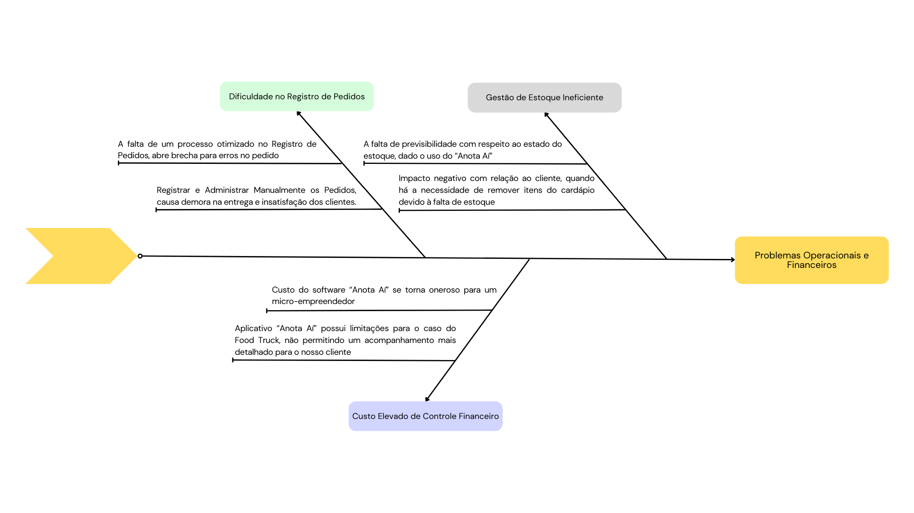

# 1. Cenário Atual Do Cliente e Do Negócio 

___________________________________________________________________________________

## 1.1 Introdução ao Negócio e Contexto

- **Famintos Burger e sua Proposta de Valor**
    

    Localizada em Sobradinho, Distrito Federal, a Famintos Burger é uma hamburgueria artesanal fundada
    por João Gabriel, que acumula as funções de proprietário e cozinheiro. A empresa atende clientes
    locais e expandiu seu público ao operar em plataformas de entrega, como o iFood, oferecendo hambúrgueres 
    de qualidade para aqueles que buscam sabores diferenciados. João conta com a ajuda de sua irmã, que cuida
    do caixa e do atendimento ao cliente.
    

- **Desafios Operacionais e Necessidade de Solução Tecnológica**
    

    Com o aumento da demanda, a Famintos Burger enfrenta desafios na eficiência e gestão de seu food 
    truck, o que torna essencial a implementação de uma solução tecnológica. Essa ferramenta deve 
    otimizar o processo de pedidos, agilizar o atendimento e simplificar o controle financeiro e 
    de estoque, permitindo uma administração mais organizada e facilitando o acompanhamento do 
    crescimento do negócio.
    

___________________________________________________________________________________

## 1.2 Identificação da Oportunidade ou Problema

O projeto é necessário para solucionar problemas operacionais e financeiros que têm impactado o
funcionamento eficiente do food truck de João Gabriel, especializado em hambúrgueres e outros lanches. 
Atualmente, João enfrenta diversos desafios, como descrito a seguir:

- **Dificuldades no Registro de Pedidos**
    

    A irmã de João, responsável pelo caixa, registra manualmente os pedidos em papel. Esse processo
    exige tempo, o que causa filas e espera prolongada para os clientes, além de ser suscetível a erros,
    como a omissão de itens ou a anotação incorreta dos detalhes do pedido. Esse método não só
    prejudica a agilidade do atendimento como também aumenta a chance de insatisfação dos clientes,
    uma vez que os erros nos pedidos são recorrentes e afetam a experiência geral no food truck.
    

- **Gestão de Estoque Ineficiente**
    

    O controle do estoque é feito de forma limitada e depende do aplicativo “Anota Aí”, que é um
    aplicativo de gestão para empreendimentos no ramo alimentício, contudo, neste caso, ele não está
    totalmente integrado ao fluxo de pedidos do food truck. Isso dificulta a atualização em tempo real
    dos itens disponíveis, fazendo com que, em alguns casos, João descubra a falta de ingredientes
    apenas no momento de preparar o pedido. Essa falta de previsibilidade prejudica o atendimento, já
    que a falta de ingredientes obriga a remoção de itens do cardápio temporariamente, afetando a
    percepção dos clientes e o potencial de venda.
    

- **Controle Financeiro e Custos Elevados**
    

    João usa o aplicativo “Anota Aí”, que possui atualmente ferramentas para controle financeiro de
    empresas, mas o custo mensal desse serviço torna-se oneroso para ele como pequeno
    empreendedor. Além disso, o aplicativo possui limitações que impedem um acompanhamento mais
    detalhado e customizado das finanças. João precisa de relatórios mais precisos sobre vendas,
    despesas e lucros para compreender melhor o desempenho do negócio e tomar decisões informadas. 
    Os altos custos de assinatura somados à falta de personalização e integração têm levado João a
    buscar uma solução própria que centralize o controle financeiro e ofereça uma visão completa do
    fluxo de caixa, economizando custos e agregando eficiência ao processo.
    

- **Diagrama de Ishikawa**
    <figure markdown="span">
    
    </figure>
___________________________________________________________________________________

## 1.3 Desafios do Projeto

O crescimento acelerado da Famintos Burger evidenciou a necessidade de aprimorar processos essenciais
para a eficiência e a qualidade do atendimento. No contexto atual, os principais desafios envolvem a
organização do fluxo de pedidos, a gestão de estoque e o controle financeiro, os quais impactam diretamente
o desempenho do food truck e a satisfação dos clientes. A solução proposta deve abordar as seguintes áreas
críticas:

- **Automação do Registro de Pedidos** 
    

    A melhoria no fluxo de pedidos é vital para garantir que o
    atendimento seja ágil e com menor margem de erro, evitando filas e a necessidade de retrabalho.
    

- **Controle Integrado de Estoque**
    

    A integração do estoque ao processo de pedidos permitirá a
    atualização em tempo real dos ingredientes disponíveis, garantindo a continuidade dos itens no
    cardápio e aumentando a previsibilidade.
    

- **Gestão Financeira Centralizada**
    

    Para reduzir custos e aprimorar a visão financeira, o sistema deve
    consolidar todas as operações financeiras em uma plataforma única, permitindo relatórios detalhados
    e um acompanhamento mais preciso dos resultados.  
    

Esses desafios demonstram a importância de uma solução que centralize e otimize o processo de pedidos, o
controle de estoque e a gestão financeira, permitindo que João Gabriel e sua irmã atendam aos clientes de
forma mais ágil, precisa e organizada.

___________________________________________________________________________________

## 1.4 Segmentação de Clientes

A Famintos Burger atende a três segmentos principais de clientes:

- **Moradores Locais e Frequentadores de Food Trucks**
    

    São clientes da região de Sobradinho e
    arredores, que buscam uma opção de fast-food artesanal, priorizando a qualidade dos ingredientes e o
    sabor diferenciado dos hambúrgueres da Famintos Burger. Esse grupo valoriza o atendimento próximo e
    costuma frequentar o food truck pessoalmente, contribuindo para a clientela regular e fiel do negócio.
    

- **Jovens e Jovens Adultos (18-35 anos)** 
    

    Esse público representa uma faixa etária que busca lanches
    artesanais e rápidos, com uma experiência de sabor diferente do tradicional. São clientes que apreciam
    novidades no cardápio, têm uma relação ativa com as redes sociais e estão dispostos a experimentar novos
    sabores e combinações, além de serem atraídos pelo ambiente informal de um food truck.
    

- **Clientes de Delivery via iFood**
    

    Com o aumento da demanda por conveniência, a Famintos Burger
    atende também um número crescente de pedidos via iFood, atraindo clientes que preferem receber o
    pedido em casa ou no trabalho. Este segmento valoriza a rapidez de entrega e a possibilidade de
    personalizar os pedidos com observações adicionais, como a remoção de ingredientes.
    

___________________________________________________________________________________