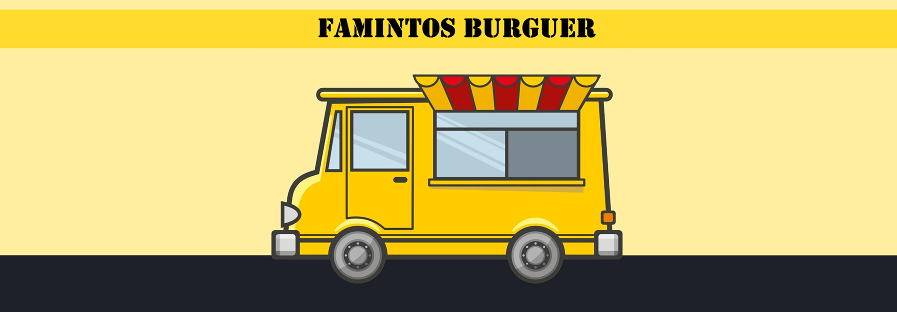

# 
**Famintos Burguer :hamburger:**

_________________________________________________________________________________

=== "Projeto"
    <figure markdown="span">
      { class="rounded-edge"}
    </figure>
=== "Centro de Ensino"
    <figure markdown="span">
      
      <figcaption>UNIVERSIDADE DE BRASÍLIA</figcaption>
    </figure>
_________________________________________________________________________________

## 💻 *Requisitos de Software*

Bem-vindo à página projeto da matéria de Requisitos de Software da Universidade de Brasília (Unb). Nesta página, apresentamos nosso projeto de desenvolvimento de um aplicativo desktop para auxiliar na gestão de pedidos de restaurantes e food trucks.

_________________________________________________________________________________

## 📄 *Sobre o Projeto*

Nosso projeto visa criar um aplicativo desktop para empresas no ramo alimentício, será capaz de auxiliar nas demandas de pedidos, atendimento e acompanhamento das demandas desse tipo de empresa.

Visite nosso repositório: [:simple-github:](https://github.com/mdsreq-fga-unb/2024.2-T01-FamintosBurguer){ .md-button--foo}

!!! note "Projeto em Andamento"

    Projeto em andamento, com progresso contínuo conforme o cronograma estabelecido pela equipe.
_________________________________________________________________________________
## 👥 *Equipe BurgerCode*

Nossa equipe é composta por 5 estudandates do curso de Engenharia de Software, Conheça os membros da equipe de desenvolvimento logo abaixo:

|    |  |  |  | | |
|:---------:|:------------------------------------------------------------------------------:|:------------------------------------------------------------------------------:|:-------------------------------------------------------------------------------:|:-------------------------------------------------------------------------------:|:-------------------------------------------------------------------------------:|
| **Nome**  | [Isaac Batista Pessoa De Moraes](https://github.com/isaacbatista26) | [João Eduardo Pereira Rabelo](https://github.com/JoaoEduardoP) | [Letícia Torres Soares Martins](https://github.com/leticiatmartins) | [Tulio Augusto Celeri](https://github.com/TulioCeleri) | [William Bernardo Da Silva](https://github.com/willxbernardo) |
| **Cargo** |Desenvolvedor | Desenvolvedor | Desenvolvedor |Desenvolvedor | Desenvolvedor |

_________________________________________________________________________________